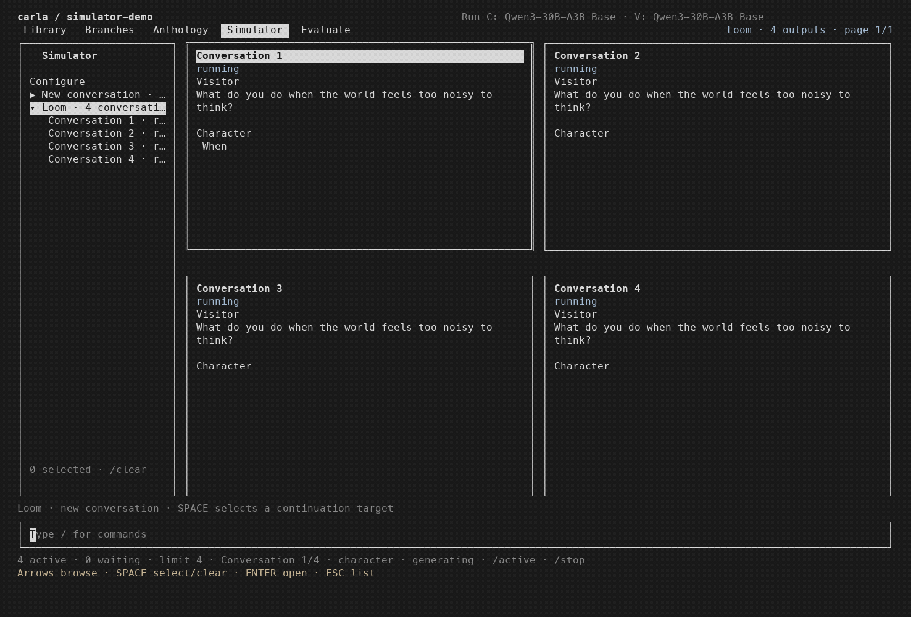

# Carla

Carla is a **Loom TUI and Character Lab** for developing new AI characters from
base models. Supply seed documents, explore alternative continuations, curate
an anthology, simulate conversations from it, and evaluate the results to decide
what belongs in a training set.



*Local Qwen3-30B-A3B Base · four-conversation Loom · playback at 1.5× speed.*

A *Loom* lets you explore branching model-generated text: continue a passage,
compare alternatives, edit or fork a version, and follow the paths worth keeping.
Carla brings that workflow into the terminal with local inference and inspectable
prompts, model settings, ancestry and judge results.

```text
Seed documents → Continuations → Anthology → Conversations → Evaluation → Training data
   Library          Branches      Anthology     Simulator     Evaluate       Export
                       ↳ loom                      ↳ loom
```

Carla currently implements **data generation, curation, evaluation and export**.
An anthology conditions the conversation model through its prompt; it does not
change model weights. Training support is a future stage. The project is inspired
by [Computer's document-grown character work](docs/resources.md), without claiming
to reproduce its training protocol or results.

## Quick start

Requirements: Python 3.11+, [uv](https://docs.astral.sh/uv/), Go 1.26+,
and a UTF-8 terminal of at least 60 × 18 cells. Development is on macOS;
Linux is included in CI but has not had equivalent interactive validation.
Native Windows is unsupported (Unix workspace locking and process replacement).

Clone the repository, enter its directory, and launch Carla:

```sh
git clone https://github.com/k3nnethfrancis/carla.git
cd carla
make install
carla
```

`make install` prepares the Python environment, builds the terminal interface,
and installs a launcher in `~/.local/bin`. If that directory is not on your PATH,
the installer prints the line to add to your shell profile.

After that, run `carla` from any directory to resume your last workspace.
Use `carla --workspace first-experiment` to create or open a named workspace.

On first launch, Carla opens a setup dialog if no configured GGUF is available.
Use ↑/↓ and Enter to choose, or Escape to go back:

- Download a tested Qwen3 **8B**, **14B**, or **30B-A3B Base** GGUF (Q4_K_M).
- Paste a Hugging Face repository or GGUF file URL and choose a file to download.
- Point to a local GGUF without copying it.
- Skip setup to browse the bundled Meditations and Tractatus starters offline.

Downloads show their size, license and pinned revision before confirmation.
Use `/config` → models → `+ Add model`, or run `carla --setup-model`, to add another model. Generation also requires
`llama-server` on PATH; see [generation setup](#set-up-generation).

Once inside Carla, select a passage with Space, open it with Enter, and explore the
panes with Tab / Shift+Tab. Type `/help` for commands or `/config` for editable
bindings. `/` focuses the command bar, including from the document editor.
The Keys dialog covers listed actions and navigation; its own capture, reset,
save and cancel controls stay fixed so you can always recover a binding.

## Commands at a glance

Type `/` anywhere to open the command bar. Start typing, use ↑/↓ to select a
suggestion, and press Enter. Commands relevant to the current page appear first.
The highlighted suggestion shows its available arguments below it—even while
typing a prefix such as `/lo`. `/help` explains each option; press Enter on a command for scrollable details.

| Command | What it does |
| --- | --- |
| `/add` · `/remove` | Add or remove material from the current collection. |
| `/branch` | Copy selected material without generating, preserving ancestry. |
| `/continue --tokens 512` | Advance the existing item or set; preserve earlier revisions. |
| `/loom 3 --tokens 512` | Generate three alternative futures of the selected item or set. |
| `/loom 3 --turns 2 --visitor "What matters to you?"` | Explore three conversational alternatives from your supplied message. |
| `/eval "Voice" --train-on-pass true` | Judge selected content and optionally mark passes for training. |
| `/export` | Save selected content or the current collection with provenance. |
| `/config` · `/policy` | Configure execution defaults and judging policies. |
| `/stop` · `/help` | Stop active work or browse command help. |
| `/library` · `/branches` · `/anthology` · `/simulator` · `/evaluate` | Open a stage. |

[Commands](docs/commands.md) covers flags, selection, editing and exports;
[interaction model](docs/interaction-model.md) explains object identity and grouping.
Models, workspace selection and keybindings are available through `/config`.

### Continue, Loom and Branch

`/continue` advances what you selected. `/loom N` creates N alternative futures
of it. `/branch` copies it without generation. The same meanings apply to a single
item or a set: selecting four conversations and running `/loom 3` produces three
sets of four; `/continue` advances the original four. Prior revisions and ancestry
remain saved, while evaluations refer to the exact content they judged.

Library, Branches and Anthology share the document generation path. Simulator
uses conversations. With no Simulator selection, `/loom 4` starts four fresh
conversations. Space/Enter selects a target; arrows only preview. Clear selection
to start fresh again. New document versions must be kept explicitly with `/add`.

```text
/loom 3 --tokens 512 --visitor "What does a path remember?" --turns 2 --eval "Voice" --loops 4
```

`--tokens` caps each generation; `--turns` counts new character replies.
`--visitor` supplies a message once per selected conversation. `--model` and
`--visitor-model` override configured models for this operation. `--eval` judges
completed outputs. `--loops` repeats generation and policy selection, preserving
whole alternative sets. Configure the selection policy before using loops.

## Set up generation

To generate, install [llama.cpp](https://github.com/ggml-org/llama.cpp) with
`llama-server` on PATH and supply a **base-model GGUF** you are licensed to use.
The server must support unified KV cache and continuous batching; see
[model setup](docs/configuration.md#models). The first-run setup writes model
configuration for you. To add a model later:

```sh
carla --setup-model
```

GGUF is a file format; quantization is optional. Model weights are never bundled
or downloaded automatically. A missing model does not prevent source browsing.

## Work through an experiment

- **Library:** select passages from shared documents; only selected text enters
  the workspace. [Import your own text](docs/configuration.md#document-library).
- **Branches:** `/loom --tokens 512` samples one continuation from the cursor;
  `/loom 3 --tokens 512` samples three alternatives. `/branch` forks the current
  version without generating. Edits preserve ancestry.
- **Anthology:** `/add` retains a document for curation. Keeping is a human
  selection, not an automatic quality verdict or training step.
- **Simulator:** `/config` chooses documents, speakers, openings and sampling.
  `/loom 3 --turns 4 --tokens 512` produces three conversations with four new
  character replies each. A visitor replies between character turns. Selecting
  an existing conversation resumes its frozen document context and history.
  Use `/clear` to start fresh; hovering over a conversation or batch does not select it. Multi-output runs stream into a selectable grid.
- **Evaluate:** create a named collection, choose judges, add frozen documents or
  conversations, and run judgments. Review evidence, add notes and mark items for
  training. Existing judgments can be attached without another model call.
  `/export` saves selected evaluation items or the collection, including evidence and training marks.

`/loom 3 --tokens 512 --loops 4` repeats candidate generation and local selection.
The selection policy lives under `/policy`; no policy instructions enter base-model
prompts. It never automatically keeps documents. Configure a selector before
starting repeated loops; see [configuration](docs/configuration.md).

## Policies and evaluations

These use criteria to judge text, but serve different purposes:

| Mechanism | When it runs | What the result does |
| --- | --- | --- |
| Monitoring | During generation and/or after replies | Flags conditions such as looping; warns or stops only as configured. Off by default. |
| Selection | During multi-loop Loom runs | Reviews candidates and chooses one path to develop. Does not automatically keep or mark it for training. |
| Evaluation | On saved items, or after `/loom --eval "name"` | Records whole-item judgments in a named collection for review and dataset curation. |

Use `/policy` to configure monitoring, selection and reusable judges. Selection
uses a local instruct model. Monitoring can use local DiffusionGemma through OpenJev, or optional Jev through
OpenRouter. Evaluation judges also support the configured local instruct model.
After [one-time setup](docs/local-judge.md), Carla starts and stops the Apple Silicon
classifier automatically on an available local port.
Hosted classification sends the assessed text to an external service and can
incur charges. Local generation itself uses llama.cpp.

In **Evaluate**, `/config` sets the collection's name, judges and active status.
Adding items does not run judges. `/eval` runs the active evaluation on selected
material; `/eval "Voice"` chooses a particular collection. An item passes when
all its currently configured judge revisions pass. You can mark training items
manually or use `/eval --train-on-pass true` to mark successful passes.

Changing a prompt, model or setting can be evaluated with the same collection
and criteria; evaluation is not limited to training decisions. Saved source
snapshots and judgment histories remain intact. Attached monitoring or selection
evidence keeps its original scope rather than becoming a whole-item pass.
Read the [policy and evaluation guide](docs/evaluations.md) for the complete flow.

## Prompts and templates

You can inspect the actual inputs behind generated text with `/inspect`.
Configuration exposes these authoring surfaces:

| Input | Where to change it |
| --- | --- |
| Continuation input | Edit/fork the document and place the cursor; the exact prefix is sent to the base model. |
| Character and Visitor templates | Simulator → `/config` → Character prompt / Visitor prompt |
| Visitor brief | Simulator → `/config` → Visitor brief |
| Fixed or generated opening | Simulator → `/config` → Opening; generated mode has its own prompt, model and sampling. |
| Selection criteria and routing prompt | `/policy` → Selection |
| Monitoring behavior specs | `/policy` → Monitoring → Behaviors |
| Evaluation criteria and local judge prompt | `/policy` → Judge configurations |

Document Loom has no separate system-message wrapper. Conversation templates are
explicit raw-completion prompts with anthology/history placeholders; there are
no hidden memory or reflection steps. [Prompt configuration](docs/configuration.md#prompts-and-templates)
shows the defaults, allowed fields and inspection behavior.

## Documentation

- [User guide](docs/user-guide.md): first experiment, editing, comparison, data storage and recovery.
- [Commands](docs/commands.md): all commands, flags, targeting and keyboard behavior.
- [Configuration](docs/configuration.md): models, sampling, prompts, source imports and credentials.
- [Local DiffusionGemma judge](docs/local-judge.md): Apple Silicon setup, behavior specs and resource limits.
- [Policies and evaluations](docs/evaluations.md): monitoring, selection, judging and training exports.
- [Architecture](docs/architecture.md), [development](docs/development.md) and
  [research references](docs/resources.md): implementation and contributor context.

## Toward training

The next research stage is to connect curated data to training and evaluate the
resulting models. Candidate features include dataset preparation with explicit
splits and loss masks, supervised character/conversation fine-tuning, preference
training from reviewed feedback, and loading trained checkpoints back into Carla
for comparison. These are directions, not shipped features or a fixed schedule.
A pass label alone is not a preference pair, and an exported trace is not yet a
trainer-specific dataset. The immediate priority remains a dependable generation
and evaluation workflow, developed with collaborator feedback.

## What to expect

- Inference uses local llama.cpp raw completions. Base-model continuations have
  no hidden assistant prompt, RAG memories or reflection step. Simulator templates
  are explicit and inspectable; the selection classifier uses a separate chat endpoint.
- Up to four requests share one resident model, subject to memory and full
  prompt/output context reservations. This is a conservative heuristic, not an
  optimal throughput scheduler. Large budgets can serialize requests. Same-model
  conversations advance independently; different model aliases require barriers
  for unloading/loading weights.
- `--tokens` is an output ceiling, not a required length. `Max` reserves the
  remaining context, often leaving room for only one request. EOS or an explicit
  speaker boundary can end a reply earlier. Token-limit observations do not end
  later conversation turns.
- Quality is an open research question. Base models can imitate source authors,
  drift, loop, or produce disturbing content. An anthology is context for the
  simulator, not evidence that a character has been learned in weights.
- Workspaces retain raw prompts and outputs. They can become large; streaming
  uses an incremental journal, but full checkpoints still occur at turn and
  operation boundaries. Recovery covers process crashes, not guaranteed survival
  of power loss. Back up valuable workspaces.
- The app has no training jobs, calibrated judge dashboard, multi-user service,
  remote deployment, or automatic research conclusions.

## Develop and contribute

Track bugs and features in [GitHub Issues](https://github.com/k3nnethfrancis/carla/issues)
and submit feature/fix PRs to `dev`. Reviewed changes reach `main` through promotion PRs.
Our current focus is [data-generation stabilization](https://github.com/k3nnethfrancis/carla/milestone/1):
UX, functional reliability and focused code review. Training work follows validation
of this stage with collaborators.
See [development and releases](docs/development.md)
and the [Carla TUI design skill](skills/tui-design/SKILL.md).
Run `carla --version` when reporting a problem.

```sh
make test
make lint
make build
```

Tests use synthetic documents and fake inference; they need no weights, GPU or
API keys. See [architecture](docs/architecture.md) for code boundaries and
[research references](docs/resources.md) for method context.

Code is [MIT licensed](LICENSE). Imported texts, model weights and generated
artifacts retain their own applicable terms. The starter library includes third-party texts; see [source attribution](src/character_lab/seeds/README.md).
For optional hosted monitoring and stored trace details, see
[configuration](docs/configuration.md#optional-monitoring).

## Releases

Carla uses versioned source releases: `v0.1.0`, `v0.1.1`, and so on. Each reviewed
promotion to `main` receives a new version and publishes a matching GitHub release
after macOS/Linux checks pass. `dev` is ongoing work. See
[GitHub releases](https://github.com/k3nnethfrancis/carla/releases) for pinned
versions and release notes, and the [release workflow](docs/development.md#app-releases)
for contributor instructions. Training is not yet implemented.
